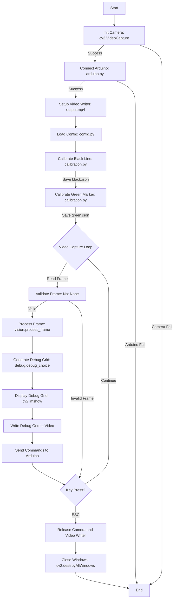
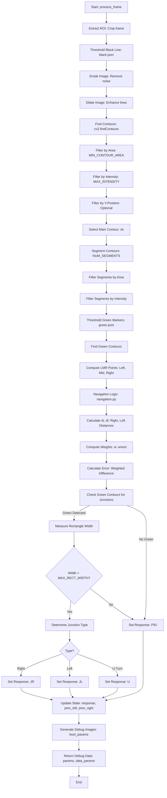

# Line-Following Robot

This project implements a line-following robot using computer vision to detect black and green lines, with real-time debug visualization and Arduino-based motor control. The robot processes camera input to track lines, detect junctions, and navigate autonomously.

## Project Overview

The robot uses OpenCV to process video frames, detecting black lines (main path) and green markers (junctions). A calibration system allows tuning for different lighting conditions, and a debug grid visualizes processing steps (e.g., ROI, contours, green lines). Commands are sent to an Arduino to control motors based on navigation decisions.

## Prerequisites

### Hardware
- **USB Camera**: Compatible with OpenCV (e.g., webcam or Raspberry Pi camera).
- **Arduino**: Connected via USB for motor control (e.g., Uno, Nano).
- **Robot Chassis**: With motors controlled by the Arduino.
- **Track**: A path with black lines and green markers for junctions.

### Software
- **Python 3.8+**: Required for running the project.
- **pip**: For installing Python dependencies.
- **Virtualenv**: Recommended for isolating dependencies.
- **Arduino IDE**: To upload motor control code to the Arduino (not included in this repo).
- **Operating System**: Tested on Linux (Ubuntu), but should work on Windows/macOS with minor adjustments.

## Setup Instructions

### 1. Clone the Repository
Clone or download the project to your local machine:

```bash
git clone https://github.com/mostfa-ghalleb/line_follower.git
cd line_follower
```

### 2. Create a Virtual Environment
Create and activate a virtual environment to isolate dependencies:

#### Linux/macOS
```bash
python3 -m venv venv
source venv/bin/activate
```

#### Windows
```bash
python -m venv venv
venv\Scripts\activate
```

You should see `(venv)` in your terminal prompt.

### 3. Install Dependencies
Install the required Python packages:

```bash
pip install opencv-python pyserial numpy
```

- `opencv-python`: For image processing and visualization.
- `pyserial`: For Arduino communication.
- `numpy`: For array operations.

### 4. Set Up the Arduino
1. **Connect the Arduino**: Plug your Arduino into a USB port.
2. **Upload Arduino Code**: Use the Arduino IDE to upload motor control code (not included here). The code should read serial commands (e.g., `PID:<error>`, `JR`, `JL`, `U`) and control motors accordingly.
3. **Verify Connection**: Ensure the Arduino is detected (e.g., `/dev/ttyUSB0` on Linux or `COM3` on Windows). The `arduino.py` script auto-detects Arduino ports.

### 5. Prepare the Camera
- Connect your USB camera.
- Ensure it’s accessible via OpenCV (typically device `0`). Test with:
  ```python
  import cv2
  cap = cv2.VideoCapture(0)
  ret, frame = cap.read()
  print("Camera working:", ret)
  cap.release()
  ```

## Running the Project

### 1. Start the Program
Run the main script from the virtual environment:

```bash
python main.py
```

### 2. Calibrate the System
The program starts with calibration for black and green lines:

#### Black Line Calibration
1. A window (`Calibrator_black_*`) opens.
2. Place the camera over the black line on your track.
3. Adjust sliders (e.g., HSV, RGB, Threshold) to isolate the black line in the "Processed" window.
   - Use the "Method Selection" window to switch methods (e.g., HSV for better color detection).
   - The processed image should show the black line as white on a black background.
4. Press `s` to save settings to `black.json`.
5. Press `ESC` to finish.

#### Green Marker Calibration
1. A window (`Calibrator_green_*`) opens.
2. Place the camera over a green marker.
3. Adjust sliders to isolate the green marker in the "Processed" window.
4. Press `s` to save settings to `green.json`.
5. Press `ESC` to proceed.

### 3. Run the Robot
- The program starts processing video, displaying a debug grid.
- The robot follows the black line, using green markers to detect junctions (e.g., left, right, U-turn).
- Commands are sent to the Arduino (e.g., `PID:<error>` for steering, `JR` for junction right).
- Press `ESC` to stop the program.

### 4. Debug Grid
The debug grid shows processing steps, each labeled with a red number (e.g., "1: Default"). It’s saved as `output.mp4`.

## Customizing the Debug Grid

The debug grid is controlled by `bool_params` in `vision.py` (line ~330). Modify this dictionary to enable/disable visualizations:

```python
bool_params = {
    "frame": True,          # Green Lines (green marker contours)
    "roi": True,            # Region of Interest
    "thresh": True,         # Black line threshold
    "eroded": True,         # Eroded threshold
    "dilated": True,        # Dilated threshold
    "contours": True,       # All contours (cyan)
    "min_area": True,       # Contours after min area filter (red)
    "max_intensity": True,  # Contours after max intensity filter (green)
    "min_y": False,         # Contours after min y filter (rarely used)
    "dx": True,             # Selected contour (white)
    "segment_contours": True,  # Segmented contours (yellow)
    "min_area_": True,      # Segmented min area contours (orange)
    "max_intensity_": True, # Segmented max intensity contours (purple)
    "dx_": True,            # Segmented selected contours (magenta)
    "lmr": True,            # Left, mid, right points (red rectangles, cyan circles)
    "response": True,       # Navigation response (text)
    "navigation": True      # Navigation parameters (text)
}
```

### How to Customize
1. Open `vision.py` in a text editor.
2. Find the `bool_params` dictionary in the `process_frame` function.
3. Set keys to `True` to include or `False` to exclude visualizations.
4. Save and rerun `main.py`.

### Debug Image Descriptions
- **Green Lines** (`frame`): Binary image of green marker contours.
- **ROI** (`roi`): Cropped region of interest from the frame.
- **Thresh** (`thresh`): Black line threshold image.
- **Eroded** (`eroded`): Threshold after erosion.
- **Dilated** (`dilated`): Threshold after dilation.
- **Contours** (`contours`): All detected contours (cyan).
- **Min Area** (`min_area`): Contours filtered by minimum area (red).
- **Max Intensity** (`max_intensity`): Contours filtered by intensity (green).
- **DX** (`dx`): Selected contour (white).
- **Segment Contours** (`segment_contours`): Segmented contours (yellow).
- **Min Area_** (`min_area_`): Segmented min area contours (orange).
- **Max Intensity_** (`max_intensity_`): Segmented max intensity contours (purple).
- **DX_** (`dx_`): Segmented selected contours (magenta).
- **LMR** (`lmr`): Left, mid, right points with rectangles (red) and midpoints (cyan).
- **Navigation** (`navigation`): Text showing navigation parameters (e.g., error, response).

### Example Customization
To show only ROI, Green Lines, and LMR:
```python
bool_params = {
    "frame": True,
    "roi": True,
    "thresh": False,
    "eroded": False,
    "dilated": False,
    "contours": False,
    "min_area": False,
    "max_intensity": False,
    "min_y": False,
    "dx": False,
    "segment_contours": False,
    "min_area_": False,
    "max_intensity_": False,
    "dx_": False,
    "lmr": True,
    "response": False,
    "navigation": False
}
```

### Workflow Diagrams

The following diagrams illustrate the workflows of the main program (main.py) and frame processing (vision.py’s process_frame), rendered directly in GitHub using Mermaid.

Main Workflow (main.py)

This shows the program flow from initialization to video processing.

Process Frame Workflow (vision.py)

This details frame processing, including navigation logic.

## Troubleshooting

### Camera Issues
- **Error**: "Failed to read frame" or blank debug grid.
- **Fix**: Ensure the camera is connected and accessible (`cv2.VideoCapture(0)`). Try a different device index (e.g., `1` in `main.py`).

### Arduino Issues
- **Error**: "No Arduino found!" in console.
- **Fix**:
  - Check USB connection and port (e.g., `/dev/ttyUSB0` or `COM3`).
  - Verify Arduino code is uploaded and listens for serial commands.
  - Install Arduino drivers if needed.

### Calibration Issues
- **Issue**: Black/green lines not detected in debug grid.
- **Fix**:
  - Rerun calibration (`python main.py`) and adjust sliders to isolate lines/markers.
  - Check `black.json`/`green.json` for valid settings.
  - Ensure track lighting is consistent with calibration conditions.

### Debug Grid Issues
- **Issue**: Missing images or unclear contours.
- **Fix**:
  - Verify `bool_params` in `vision.py` enables desired images.
  - Check console for warnings (e.g., "Invalid image for key").
  - Adjust contour colors in `debug.py` if needed (e.g., change `(255, 255, 0)` to `(200, 200, 0)` for darker yellow).

### Console Warnings
- **Warning**: "Invalid image for key '<key>'" or "Invalid green lines image".
- **Fix**: Indicates a processing issue (e.g., empty frame, bad calibration). Check camera feed, recalibrate, or share console output for debugging.

## Project Structure

```
line_follower/
├── main.py           # Main script to run the robot
├── vision.py         # Vision processing (ROI, contours, green lines)
├── debug.py          # Debug grid visualization
├── calibration.py    # Calibration for black/green lines
├── navigation.py     # Navigation logic and state management
├── arduino.py        # Arduino communication
├── config.py         # Constants (e.g., contour thresholds)
├── black.json        # Black line calibration settings
├── green.json        # Green marker calibration settings
└── README.md         # This file
```

## Customization Tips

### Adjust Constants
Edit `config.py` to tweak vision/navigation parameters:
```python
MIN_CONTOUR_AREA = 10        # Minimum contour area
MAX_INTENSITY = 255          # Max intensity for contours
NUM_SEGMENTS = 10            # Number of contour segments
MAX_RECT_WIDTH = 200         # Max width for junction detection
```
- Increase `MIN_CONTOUR_AREA` to filter noise.
- Adjust `MAX_RECT_WIDTH` for different track widths.

### Modify Contour Colors
Edit `debug.py` to change contour colors (e.g., for better visibility):
```python
color = {
    "contours": (0, 255, 255),     # Cyan
    "min_area": (255, 0, 0),       # Red
    "max_intensity": (0, 255, 0)   # Green
}
```
- Use RGB tuples (e.g., `(255, 255, 0)` for yellow).
- Ensure colors are distinct and visible.

### Increase Contour Thickness
In `debug.py`, change the thickness in `cv2.drawContours` (e.g., from `4` to `6`):
```python
cv2.drawContours(img, params[key], -1, color, 6)
```

### Add Logging
Add print statements or use a logging library to track navigation decisions:
```python
# In navigation.py, process_navigation_logic
print(f"Navigation response: {state['response']}")
```

## Contributing
Feel free to submit issues or pull requests to improve the project. For major changes, please discuss via issues first.

## License
This project is unlicensed. Use it at your own discretion.

---

*Last updated: May 2025*